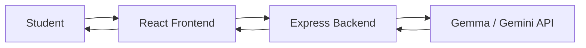

# 🎓 AI Study Buddy

> **Ask anything. Learn simply. Study smarter.**

AI Study Buddy is your personal AI learning companion that helps you understand difficult concepts, prepare for exams, and practice what you learn — all through natural conversation.

Built with **Gemma** via the Google Gemini API, AI Study Buddy goes beyond simple Q&A. It acts as a patient, friendly tutor that adapts explanations to your level, remembers conversation context, and offers multiple study modes.

---

## 🧩 Problem

Students often struggle to understand complex technical concepts from textbooks and lectures. They need explanations adapted to their level, exam-ready answers on demand, and a way to test their understanding — without waiting for office hours.

## 💡 Solution

AI Study Buddy provides a conversational AI tutor that:

- Explains concepts in simple, beginner-friendly language
- Maintains conversation context for natural follow-up questions
- Offers structured study modes (Explain, Exam Answer, Quiz, Example)
- Supports image-based questions (upload handwritten notes, textbook pages, etc.)
- Renders formatted responses with code blocks, tables, and lists

---

## ✨ Features

- 🤖 **Conversational AI Tutor** — Ask questions and get clear, personalized explanations
- 💬 **Follow-up Questions** — Continue the conversation naturally with context preserved
- 💡 **Explain Simply** — Break down any topic into beginner-friendly language
- 📝 **Exam Answer Mode** — Get structured, exam-ready answers with definitions, key points, and examples
- 🧠 **Quiz Mode** — Test yourself with auto-generated MCQs on any topic
- 💻 **Example Mode** — Get practical, real-world, or programming examples
- 📷 **Image Questions** — Upload photos of notes, textbooks, or diagrams and ask about them
- 📄 **Markdown Responses** — AI replies are formatted with headings, code blocks, tables, and lists
- 📱 **Responsive Design** — Works on desktop and mobile

---

## 🤖 Why Gemma

This project uses **Gemma** (via the Google Gemini API) as the learning and understanding engine — not just a chatbot wrapper. Gemma powers:

- **Contextual understanding** of student questions and follow-ups
- **Adaptive explanations** that adjust to the student's level
- **Structured content generation** for exam answers, quizzes, and examples
- **Multimodal understanding** for image-based questions
- **Natural conversation** with full session context

The AI is the core of the learning experience, not a bolt-on feature.

---

## 🛠️ Tech Stack

| Layer | Technology |
|-------|-----------|
| **Frontend** | React, Vite, Tailwind CSS |
| **Backend** | Node.js, Express.js |
| **AI** | Google Gemini API (Gemma model) |
| **Tools** | Git, GitHub |

---

## 🏗️ Architecture



The API key exists **only on the backend**. The React frontend calls the Express API, which securely communicates with the Gemini API.

---

## 📁 Project Structure

```
ai-study-buddy/
├── client/                  # React frontend
│   ├── src/
│   │   ├── components/
│   │   │   ├── ChatWindow.jsx
│   │   │   ├── ChatMessage.jsx
│   │   │   ├── ChatInput.jsx
│   │   │   ├── WelcomeScreen.jsx
│   │   │   ├── FeatureCard.jsx
│   │   │   └── Header.jsx
│   │   ├── App.jsx
│   │   ├── main.jsx
│   │   └── index.css
│   ├── index.html
│   ├── package.json
│   └── vite.config.js
├── server/                  # Express backend
│   ├── routes/
│   │   └── chat.js
│   ├── services/
│   │   └── gemmaService.js
│   ├── middleware/
│   │   └── errorHandler.js
│   ├── server.js
│   └── package.json
├── .env.example
├── .gitignore
├── README.md
└── package.json
```

---

## 🚀 Setup

### Prerequisites

- [Node.js](https://nodejs.org/) v18 or higher
- A [Google Gemini API key](https://aistudio.google.com/apikey)

### 1. Clone the repository

```bash
git clone <repository-url>
cd ai-study-buddy
```

### 2. Install dependencies

```bash
# Install all dependencies (root + server + client)
npm run install:all
```

### 3. Configure environment variables

Create a `.env` file in the project root:

```env
GEMINI_API_KEY=your_api_key_here
GEMMA_MODEL=gemma-3-27b-it
PORT=5000
```

> ⚠️ **NEVER commit your `.env` file.** It is already listed in `.gitignore`.

### 4. Run locally

```bash
# Start both frontend and backend
npm run dev
```

- **Frontend**: http://localhost:5173
- **Backend**: http://localhost:5000

### Production Build

```bash
# Build the React frontend
npm run build

# Start the production server
npm start
```

The production server serves the built React app and the API from a single port.

---

## 💬 Example Questions

Try asking:

- "Explain inheritance in Java like I'm a beginner."
- "What is supervised learning?"
- "Explain Master-Detail relationship in Salesforce."
- "Explain Agile methodology in simple language."
- "Give me 3 MCQs about machine learning."

---

## 🔮 Future Improvements

- 🎤 Voice conversation
- 👤 User accounts and study history
- 📚 Personalized learning paths
- 🃏 Flashcard generation
- 📄 PDF/notes analysis
- 📊 Progress tracking
- 🌐 Multiple language support

---

## 🏆 Hackathon

**Hacktoberfest Hack Day — Bhopal**

**Challenge:** AI Study Buddy / Best Use of Gemma

---

## 📄 License

This project was built for a hackathon. Feel free to learn from it and build upon it.
